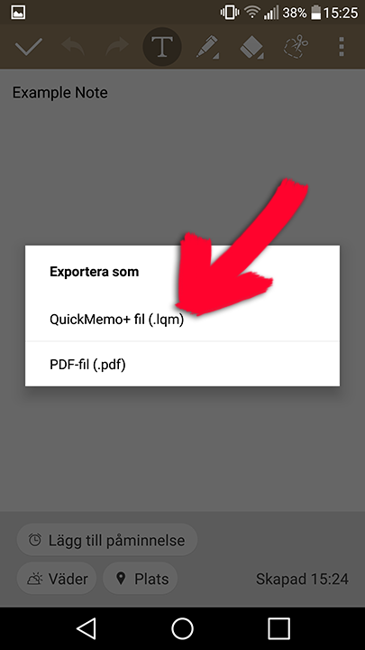

# extract-quickmemo
Extract LG quickmemo note data to .txt files

I found myself wanting to transfer my notes from LG QuickMemo+ to another app.

Unfortunately I couldn't find a way of extracting that data cleanly from the app, so I wrote this.

# Install

**requires:** Python. Minimum version: 3.6

**if git:** *git clone https://github.com/rBrenick/extract-quickmemo*

**if manual:** download package zip and put it in some folder on disk.

# How To Use

1. Open the app and export the notes.

(Your app will probably be in english, but the buttons should be in a similar location)

2. Get them to a computer somehow.

3. Put them in the 'quickmemo_lqm_files' folder.

4. Open Command Line in the folder

(you can quickly do so by typing **cmd** into the address bar of the folder)

5. Run this command: **python extract_files.py**

# Result
.txt files with the note contents should be output into *extract_quickmemo\quickmemo_output*

